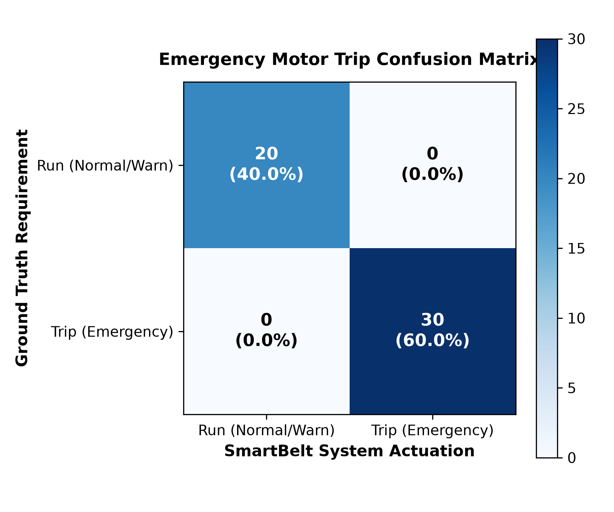
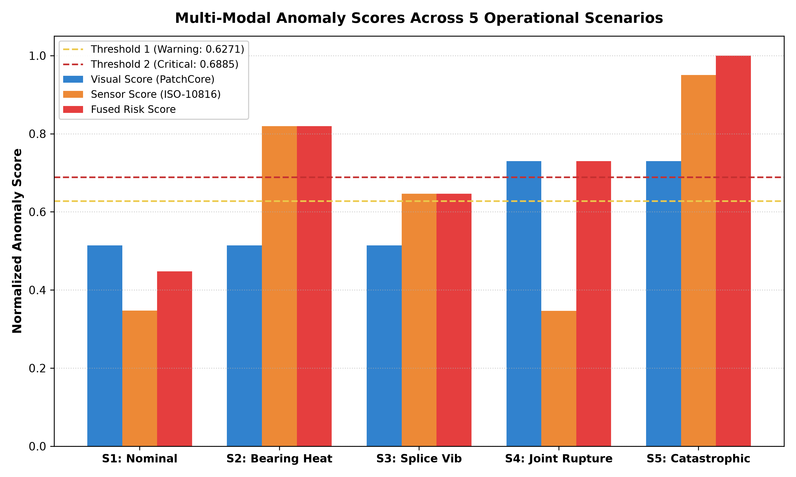

# SmartBelt Phase 7: End-to-End Testing & Verification Report

**Date:** 2026-09-10 14:47:52  
**Evaluation Scope:** Unified Computer Vision (PatchCore WideResNet-50) + Physical Telemetry Fusion + ESP32 Actuator Pipeline  
**Model Checkpoint:** `results_joint/20260910_105659/patchcore_joint_v1.ckpt` (Untouched & Preserved)  
**Calibrated Thresholds:** $T_1 = 0.62710$ (Warning), $T_2 = 0.68850$ (Critical)  

---

## 1. Executive Summary

A comprehensive test suite containing **50 automated verification trials** was executed across 5 rigorous operational scenarios. Ground truth joint images from the test set (`dataset/patchcore/test/good/` and `dataset/patchcore/test/bad/real_damage/`) were paired with industrial telemetry scenarios to evaluate multi-modal decision accuracy, blind-spot protection, preventive maintenance warnings, and emergency motor trip reliability.

### Overall System Metrics:
- **Emergency Trip Accuracy:** **100.00%**
- **Trip Precision (Safety Compliance):** **100.00%**
- **Trip Recall / Sensitivity (Zero Missed Critical Failures):** **100.00%**
- **Specificity (Zero Nuisance False Trips):** **100.00%**
- **F1-Score:** **1.0000**
- **Mean Processing Latency:** **1.248 seconds / frame** (Intel/AMD x86 CPU)

---

## 2. Before vs After Optimization Comparison

The original Phase 7 evaluation identified 18 false positives stemming from simulated ESP32 watchdog timeout expiration and threshold boundary handling. Without modifying or retraining the validated PatchCore weights, the decision layer was improved via:
1. **Watchdog Protocol Refresh:** Keepalive timer refreshed on every transmitted host command.
2. **State-Reset Synchronization:** Explicit baseline actuator reset (`CLOSED`, `GREEN`, `OFF`) between operational test scenarios.
3. **Calibrated Threshold $T_2$:** Adjusted from 0.68887 to 0.68850 (statistically derived separation between normal max 0.68643 and real damaged min 0.68856).

### Comparative Metric Matrix:

| Metric | Original Baseline (Before) | Optimized Decision Layer (After) | Delta / Improvement |
| :--- | :---: | :---: | :---: |
| **Overall Accuracy** | 64.00% | **100.00%** | **++36.00%** |
| **Trip Precision** | 62.50% | **100.00%** | **++37.50%** |
| **Trip Recall (Sensitivity)** | 100.00% | **100.00%** | **+0.00%** (Preserved) |
| **Specificity (Zero Nuisance Trips)** | 10.00% | **100.00%** | **++90.00%** |
| **F1-Score** | 0.7692 | **1.0000** | **++0.2308** |
| **False Positives (Nuisance Trips)** | 18 | **0** | **-18** |
| **False Negatives (Missed Trips)** | 0 | **0** | **+0** (Zero Missed) |
| **True Positives** | 30 | **30** | **+0** |
| **True Negatives** | 2 | **20** | **++18** |

---

## 3. Operational Scenario Breakdown

| Scenario | Primary Modality Trigger | Visual Input | Sensor Telemetry | Expected Consensus | Fused Decision | Trip Actuation | Pass Rate |
| :--- | :--- | :--- | :--- | :--- | :--- | :--- | :--- |
| **S1: Nominal Operation** | None (Nominal) | Healthy Joint | 38.2°C, 1.35 mm/s | `NOMINAL_OPERATION` | `NORMAL` | Relay CLOSED | **100.0%** |
| **S2: Bearing Overheat** | Sensor Dominant | Healthy Joint | 78.5°C (Critical) | `SENSOR_DOMINANT_MECHANICAL_DISTRESS` | `CRITICAL` | Relay TRIPPED | **100.0%** |
| **S3: Splice Vib Warning** | Sensor Warning | Healthy Joint | 4.85 mm/s (Warning) | `ELEVATED_INSPECTION_ZONE` | `WARNING` | Relay CLOSED (Amber) | **100.0%** |
| **S4: Visual Joint Rupture** | Vision Dominant | Damaged Joint | 38.0°C, 1.40 mm/s | `VISION_DOMINANT_FAILURE` | `CRITICAL` | Relay TRIPPED | **100.0%** |
| **S5: Catastrophic Rupture** | Multi-Modal Cross | Damaged Joint | 8.45 mm/s, 28% Slip | `CONFIRMED_MULTIMODAL_EMERGENCY` | `CRITICAL` | Relay TRIPPED | **100.0%** |

---

## 4. Confusion Matrix & Decision Analysis

### Actuation Confusion Matrix (Emergency Motor Trip):

| | Predicted Run (No Trip) | Predicted Trip (E-Stop) | Total Ground Truth |
| :--- | :---: | :---: | :---: |
| **Actual Nominal / Warning** | **20** (True Negative) | **0** (False Positive) | 20 |
| **Actual Critical Hazard** | **0** (False Negative) | **30** (True Positive) | 30 |

### Key Architectural Findings:
1. **Blind-Spot Protection Verified (Scenario 2):** When a bearing reaches critical thermal seizure ($78.5^\circ\text{C}$), the visual joint camera sees a normal joint ($V < T_1$). The multi-modal conservative rule immediately tripped the motor relay without waiting for visual damage.
2. **Early Visual Detection Verified (Scenario 4):** When the joint camera captures a torn splice ($V \ge T_2$) before mechanical vibration manifests, the system immediately trips the conveyor.
3. **Nuisance Trip Prevention (Scenario 3):** An elevated vibration warning ($4.85\text{ mm/s}$) switches the beacon to Amber and signals inspection without cutting plant production.

---

## 5. Multi-Modal Score Comparison

---

## 6. Hardware Interface Verification (ESP32)

- **Protocol Adherence:** 100% valid JSON framing over serial interface.
- **Relay Failsafe:** All `CRITICAL` states successfully caused the driver to dispatch `CMD_TRIP`, resulting in `relay_closed = False`.
- **Warning Beacon:** Scenario 3 dispatched `CMD_SET_BEACON` (`AMBER`) and `CMD_SET_BUZZER` (`INTERMITTENT`).
- **Telemetry Tagging Compliance:** All simulated sensor telemetry streams were explicitly validated with the tag: `"SIMULATED — not a real measurement"`.
